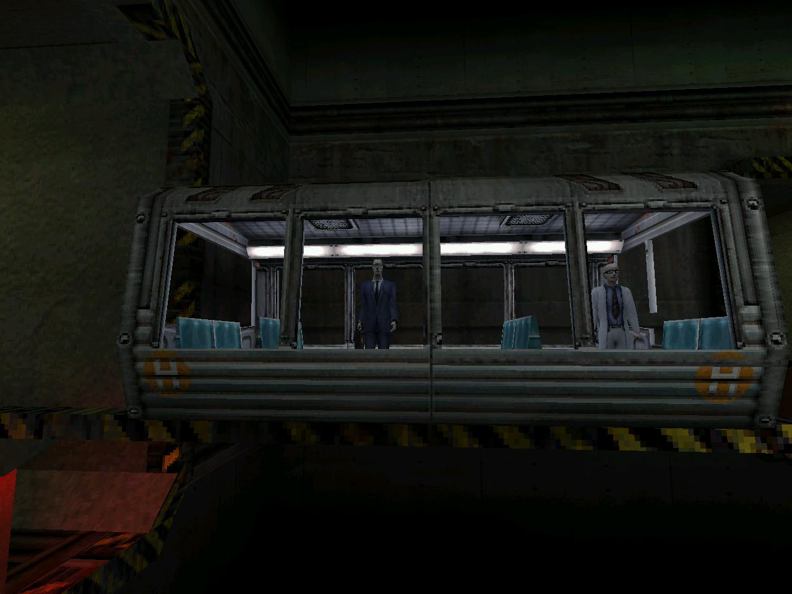

+++
title = "Correr, Pensar, Disparar, Vivir"
date = "2022-05-18T05:33:50-03:00"
readingTime = true
+++

Half-Life cambia la forma en que pensás sobre la vida; no es un shooter en primera persona normal. Como alguien que creció jugando Doom, la primera vez que jugué Half-Life tuve una de las realizaciones más importantes de mi infancia: no necesitas tanta habilidad si realmente pensás, y huir de los problemas es muy útil y aceptable a veces (una de las razones por las que también me encantaba jugar Resident Evil en mi PSone en ese entonces, pero me asustaba mucho).

Era un domingo soleado; tenía alrededor de 4 años, y mi hermano me dijo que fuera al local de juegos (sí, caminando físicamente) y comprara Counter-Strike (era el juego más popular en los cibers de Buenos Aires). Así que fui con mi papá. En ese momento, había 2 Counter-Strike disponibles (normal y Condition Zero), así que traje ambos a casa, inserté el primer disco en la compu, y apareció una pantalla de Half-Life.

Noté que la caja del CD decía "Half-Life Counter-Strike" y pensé, "¿Qué es Half-Life? Suena divertido! :)"

El CD (obviamente pirateado) incluía en realidad:

- [Half-Life](https://store.steampowered.com/app/70/HalfLife/)
- [Half-Life: Opposing Force](https://store.steampowered.com/app/50/HalfLife_Opposing_Force/)
- [Half-Life: Blue Shift](https://store.steampowered.com/app/130/HalfLife_Blue_Shift/)
- [Team Fortress Classic](https://store.steampowered.com/app/20/Team_Fortress_Classic/)
- [Ricochet](https://store.steampowered.com/app/60/Ricochet/)
- [Deathmatch Classic](https://store.steampowered.com/app/40/Deathmatch_Classic/)
- [Counter-Strike](https://store.steampowered.com/app/10/CounterStrike/)

Instalé todo y abrí Half-Life primero porque me gustaba más la estética. Empecé a jugar, y... APARECIÓ UN PUTO TREN. Nunca había estado en un tren en movimiento en un juego antes, y me encantan los trenes, así que me gustó. El tren tardó mucho tiempo en llegar a destino, así que sentí que el juego no tenía apuro y eso me encantó.

Un par de minutos después, ¡el mundo se va a la verga D:! ¡Pero el juego es precioso :D!. Así que ahí estaba, corriendo como una especie de científico con un "Hazardous Environment Suit" genial, y en la vida real llevaba un traje de Spiderman, así que me sentí identificado.

Agarré una buena palanca y apreté un botón para llamar un ascensor, inadvertidamente causando una falla que mató a un par de compañeros científicos :(

D:

:((( Qué acabo de hacer??

Y luego empecé a defenderme. En Half-Life, los combates son un rompecabezas para resolver; no es como esos juegos donde tenés que morir para saber algo y luego reintentarlo, pasándolos con fuerza bruta (siempre me pregunté cómo sabés esas cosas sin morir primero). En Half-Life, realmente tenés que valorar tu vida y tratarla como lo más importante que tenés.

Sos un hombre de ciencia, no un asesino. Si ves una amenaza, primero corrés para protegerte, después pensás en cómo aprovechar tus herramientas, el entorno y el conocimiento contra el enemigo. Si realmente no necesitas matar a nadie, no lo hacés, pero si lo hacés, ahora tenés un plan.

El juego tiene algunos mensajes interesantes detrás:

- Probablemente vas a matar vida por accidente.
- Tu jefe se va a tomar el palo si algo realmente malo sucede.
- El gobierno no te va a salvar, y no deberías confiar en ellos.
- Un individuo puede tener un impacto real en el mundo, así que sos importante.
- El mundo es caótico, y muchos eventos no están planificados.
- Nadie está realmente seguro de lo que está pasando.
- No esperés que alguien te diga lo que tenés que hacer; pensá, intentá y rompé cosas.
- Cuando todo se va al infierno, podés tener a tus amigos para que te ayuden, pero si no, estás solo con vos mismo y tal vez con un par de armas copadas.
- Tu búsqueda de la libertad puede nunca terminar.
- Tu peor enemigo parece ser un burócrata interdimensional que quiere darte un trabajo.
- Hablar no es tan importante.


<video src="mashup.webm" width="100%" preload autoplay muted playsinline loop></video>


He visto a mucha gente tener problemas para jugar Half-Life porque esperan que el juego les diga qué hacer, y si el juego no lo hace, ¡no hacen nada! El juego se trata de curiosidad y de probar nuevas ideas, y eso se extiende a mucho más que la historia.

El juego está lleno de mods y de una comunidad que intenta cosas raras, y Valve (la empresa detrás de Half-Life) lo permite y lo promueve, desatando mucha creatividad artística y posibilidades. Por eso tenemos muchos juegos basados en Half-Life. Siento que gran parte de eso se ha perdido, y estamos encerrados en walled gardens.

Si no jugaste Half-Life, probalo. La lista de juegos es:

- [Half-Life](https://store.steampowered.com/app/70/HalfLife/) (hay un remake tremendo llamado [Black Mesa](https://store.steampowered.com/app/362890/Black_Mesa/))
- [Half-Life 2](https://store.steampowered.com/app/220/HalfLife_2/)
- [Half-Life 2: Episode One](https://store.steampowered.com/app/380/HalfLife_2_Episode_One/)
- [Half-Life 2: Episode Two](https://store.steampowered.com/app/420/HalfLife_2_Episode_Two/)
- [Half-Life: Alyx](https://store.steampowered.com/app/546560/HalfLife_Alyx/) (juego de realidad virtual)

No esencial:

- [Half-Life: Opposing Force](https://store.steampowered.com/app/50/HalfLife_Opposing_Force/) (jugás la historia de HL1 desde la perspectiva de uno de tus enemigos, un soldado. Me encanta este juego por la estética, armas y los tanques y helicópteros copados)
- [Half-Life: Blue Shift](https://store.steampowered.com/app/130/HalfLife_Blue_Shift/) (jugás la historia de HL1 desde la perspectiva de uno de tus amigos, un guardia de seguridad)
- [Half-Life 2: Lost Coast](https://store.steampowered.com/app/340/HalfLife_2_Lost_Coast/) (es solo una demo técnica corta, y se siente como un sueño fuera de contexto que tuviste)

También deberías jugar [Portal](https://store.steampowered.com/app/400/Portal/) y [Portal 2](https://store.steampowered.com/app/620/Portal_2/) ya que tienen lugar en el mismo universo, pero son juegos diferentes y geniales a su manera.
