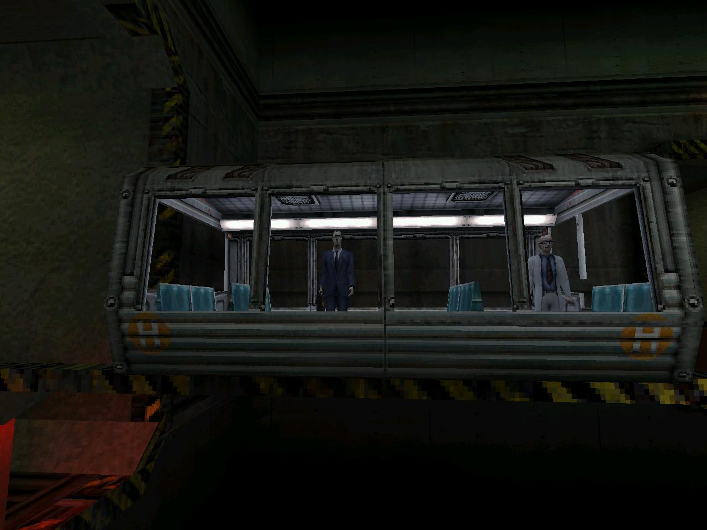
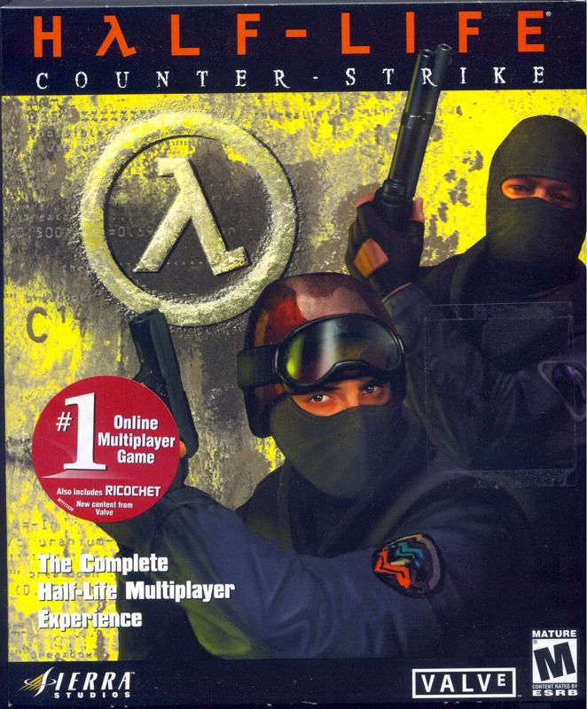

+++
title = "走れ、考えろ、撃て、生きろ"
date = "2022-05-18T05:33:50-03:00"
readingTime = true
+++

Half-Lifeは人生の考え方を変える。普通のFPSじゃない。Doomをやって育った自分にとって、初めてHalf-Lifeをプレイした時、子供の頃で最も重要な気づきの一つを得た：ちゃんと考えれば、そこまでスキルは必要ない。そして問題から逃げることは時にとても有用で、受け入れられることだ（当時PlayStationでバイオハザードをやるのも大好きだった理由の一つだけど、めちゃくちゃ怖かった）。

晴れた日曜日だった。4歳くらいの時、兄がゲーム屋に行って（そう、物理的に歩いて）Counter-Strikeを買ってこいと言った（ブエノスアイレスのネットカフェで一番人気のゲームだった）。だから父と一緒に行った。当時Counter-Strikeは2つあって（通常版とCondition Zero）、両方持って帰ってきて、最初のディスクをパソコンに入れたら、Half-Lifeの画面が出てきた。

CDのケースに「Half-Life Counter-Strike」と書いてあるのに気づいて、「Half-Lifeって何？楽しそう！ :)」と思った。

その（明らかに海賊版の）CDには実際にこれが入っていた：

- [Half-Life](https://store.steampowered.com/app/70/HalfLife/)
- [Half-Life: Opposing Force](https://store.steampowered.com/app/50/HalfLife_Opposing_Force/)
- [Half-Life: Blue Shift](https://store.steampowered.com/app/130/HalfLife_Blue_Shift/)
- [Team Fortress Classic](https://store.steampowered.com/app/20/Team_Fortress_Classic/)
- [Ricochet](https://store.steampowered.com/app/60/Ricochet/)
- [Deathmatch Classic](https://store.steampowered.com/app/40/Deathmatch_Classic/)
- [Counter-Strike](https://store.steampowered.com/app/10/CounterStrike/)

全部インストールして、見た目が好きだったからまずHalf-Lifeを開いた。プレイし始めたら...クソでかい列車が現れやがった。ゲームの中で動いている列車に乗ったのは初めてで、列車が好きだからテンションが上がった。列車が目的地に着くまでかなり時間がかかって、ゲームがゆったりしてて、それが最高だった！

数分後、世界がぶっ壊れる D:！でもゲームの見た目は最高 :D！だからそこで、カッコいい「Hazardous Environment Suit」を着た科学者みたいな感じで走り回っていて、現実ではスパイダーマンのスーツを着ていたから、なんか自分と重なった。

いい感じのバールを拾って、エレベーターを呼ぶボタンを押したら、うっかり故障を起こして何人かの仲間の科学者が死んでしまった :(

D:

:((( 俺は何をしてしまったんだ??

そこから自分を守り始めた。Half-Lifeでは、戦闘は解くべきパズルだ。何かを知るために死んで、やり直して、力ずくでクリアするようなゲームじゃない（死なずにどうやってそういうことを知るんだろうといつも疑問に思っていた）。Half-Lifeでは、本当に自分の命を大切にして、持っている中で最も重要なものとして扱わなければならない。

君は科学者であって、殺し屋じゃない。脅威を見たら、まず自分を守るために逃げて、それから道具、環境、知識を敵にどう活かすか考える。本当に誰かを殺す必要がなければ殺さない。でも必要なら、もう計画がある。

このゲームには興味深いメッセージがある：

- たぶんうっかり命を奪ってしまう。
- 本当にヤバいことが起きたら、上司はトンズラする。
- 政府は助けてくれないし、信用すべきじゃない。
- 個人は世界に本当の影響を与えられる。だから君は重要だ。
- 世界は混沌としていて、多くの出来事は計画されていない。
- 何が起きているのか本当に分かっている人はいない。
- 誰かに何をすべきか教えてもらうのを待つな。考えて、試して、壊せ。
- 全てが地獄と化した時、助けてくれる友達がいるかもしれないが、いなければ自分自身とカッコいい武器だけだ。
- 自由の追求には終わりがないかもしれない。
- 最悪の敵は、仕事をオファーしたがる異次元の官僚のようだ。
- 話すことはそれほど重要じゃない。

<video src="/en/blog/half-life/mashup.webm" width="100%" preload autoplay muted playsinline loop></video>

多くの人がHalf-Lifeをプレイするのに苦労しているのを見てきた。ゲームが何をすべきか教えてくれることを期待して、教えてくれないと何もしない！このゲームは好奇心と新しいアイデアを試すことが全てで、それはストーリーをはるかに超えたところまで広がっている。

ゲームにはmodが溢れ、変なことを試すコミュニティがあって、Valve（Half-Lifeの開発会社）はそれを許可し推進して、大量のアーティスティックな創造性と可能性を解き放った。だからHalf-Lifeをベースにしたゲームがたくさんある。その多くが失われて、ウォールドガーデンに閉じ込められてしまったと感じている。

Half-Lifeをプレイしたことがないなら、やってみてほしい。ゲームリストはこれ：

- [Half-Life](https://store.steampowered.com/app/70/HalfLife/) ([Black Mesa](https://store.steampowered.com/app/362890/Black_Mesa/)というとんでもないリメイクがある)
- [Half-Life 2](https://store.steampowered.com/app/220/HalfLife_2/)
- [Half-Life 2: Episode One](https://store.steampowered.com/app/380/HalfLife_2_Episode_One/)
- [Half-Life 2: Episode Two](https://store.steampowered.com/app/420/HalfLife_2_Episode_Two/)
- [Half-Life: Alyx](https://store.steampowered.com/app/546560/HalfLife_Alyx/) (VRゲーム)

必須ではないもの：

- [Half-Life: Opposing Force](https://store.steampowered.com/app/50/HalfLife_Opposing_Force/) (HL1のストーリーを敵の一人である兵士の視点でプレイする。雰囲気、武器、カッコいい戦車やヘリが特に好き)
- [Half-Life: Blue Shift](https://store.steampowered.com/app/130/HalfLife_Blue_Shift/) (HL1のストーリーを友人の一人である警備員の視点でプレイする)
- [Half-Life 2: Lost Coast](https://store.steampowered.com/app/340/HalfLife_2_Lost_Coast/) (短い技術デモで、文脈のない夢を見たような感じ)

[Portal](https://store.steampowered.com/app/400/Portal/)と[Portal 2](https://store.steampowered.com/app/620/Portal_2/)も同じ世界観だからプレイすべきだけど、別のゲームとしてそれぞれ独自の魅力がある。
