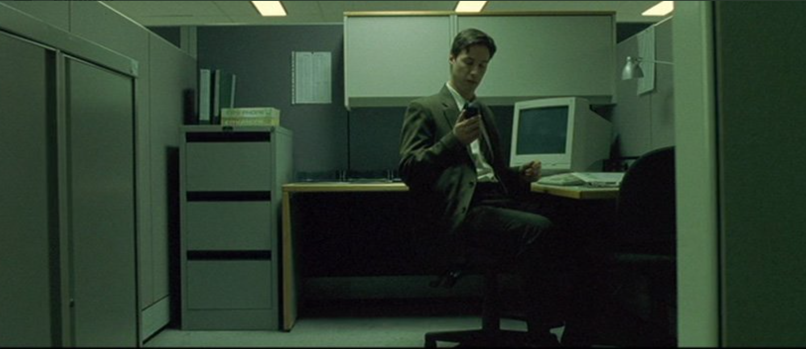

+++
title = "自分に投資するな"
date = "2024-05-12T09:03:20-03:00"
readingTime = true
+++

金融Twitterを見ていたら、若いと明かした人が有名なTwitterユーザーに「何に投資すべきか」というお決まりの質問をしているのを見つけた。回答は、そんなことは考えずに「自分に投資しろ」というものだった。

<!--more-->

なんでこれがどう考えてもバカげてるか説明する。

俺はアドバイス全般にかなり悲観的だ。そもそもそんなもの存在しないからだ。「これに投資すべき？あれに？」「AndroidとiOSどっちが安全？」「アプリとウェブどっちがいい？」「VPN使うべき？」これらの質問はそのままじゃ答えようがない。答えは常に「場合による」。人はそれぞれユニークで、個人ごとに答えは違う。しかも同じ人でも、明日には答えが変わるかもしれない。だからシステムの世界では答えを学ぶんじゃなく、要件を理解して解決策にたどり着く技術を学ぶんだ。

「自分に投資する」というアイデアに、めちゃくちゃシンプルな話から突っ込んでみよう：ネット上の無料の知識の量は文字通り無限だ。じゃあなんで使えないの？見つけて活かす方法を知ること、そして脳は一つしかなく1日は24時間しかないからだ。実際に自分にいくら投資できる？ほんの少しだ。

極端な話にしよう：15歳の人に100万ドル渡したら、どうやって自分に投資する？世界で最も高い大学を探して複数の学位に同時に入学する？それに何の意味がある？支払っているものがもはや教育ではなく、それだけ吸収する能力もないポイントが必ずある。それに人脈を作るメリットは万人向けじゃない。君にはそうかもしれないが、多くの人にはそうじゃない。まあ全部きれいごとだけど、カモにされんなよ。

いくつかの国では、「自分に投資しすぎた」人々が期待したリターンを得られず、今は借金を抱えているという問題がある。学びたいことや興味のあることを学ぶべきだと思うが、それが何かの「役に立つ」保証は何もないし、誰もそんな保証をすべきではないと常に知っておくべきだ。金を稼ぐために大事なのはあれこれ山ほど学ぶことじゃなく、一つのことを追い続けて改善する粘り強さだ。

人が持つ最も価値あるものは時間だ。「自分に投資する」ために必要なのは、何よりも時間であって、金じゃない。

若い人を投資から遠ざけるのは犯罪的だ。なぜなら時間のアドバンテージがヤバいからだ。マジで言うと、**赤ちゃん**から投資を始めるべきなくらいだ。

例えば、誰かが生まれた時から毎月100ドルを寄付して、全てを株とビットコインに入れたら、18歳になった時には複利のおかげで自分の家を持てる。その子は残りの人生で飯代とネット代しか固定費がない。そのアドバンテージを想像してみろ。

資本のない若者ができる最善のことは、壁にぶつかることだ。ただし意識的に。考えずに金を問題に投げつけるのは最善じゃない。「安全策を取れ」と勧めるのが悪いアイデアであるのと同様に、ただぶつかるだけなのもダメだ。

貯蓄と投資の価値観は何も持っていなくても役立つ。何かを持つ前にそれについて考えなければ、持った時にどう管理すべきか分からない（宝くじの当選者のほとんどがどうなるか、あるいは地面に無限の金がある国がどうクラッシュするか調べてみろ）。投資について何も知らず経験もないなら、働くことすら役に立つか疑問だ。45年働いて退職して騙されたと感じる人がいるのはそういうことだ。

13歳の時、経済にとても興味を持ち、なぜインフレがあるのか理解しようとした。問題がかなりバカバカしいことに驚いた。発行量と需要が安定しているものを探して金について学び、その瞬間から金を買い始めた。でもその後、13歳で月50ドルしか稼いでいないのに金に投資するのはバカだと気づいた。そもそも守る金がなかった。そこでリスクの高いものに全てを賭けるのが最善だと気づき、全てをビットコインに突っ込んだ。その瞬間から、稼いだ一銭一銭をビットコインの購入に使った。ゼロになっても構わなかった。自分のアドバンテージに気づいたんだ：まだ13歳だ、失うものなんてない。

その時期、ギャンブルやオンライン賭博にも手を出して、大金を勝ったり負けたりした。後になってこの経験がどれだけヤバかったか気づいた：カジノで家を賭けた50歳の男の感覚を味わったが、40年早く、頭をブチ抜くこともなく。それが友人たちとは異なるリスク理解能力を与えてくれた。プライスレスな知識を、めちゃくちゃ早い段階で、めちゃくちゃ安く手に入れた。

もう勝った人に何をすべきか聞くな。君の優位性は違う。人生で最もリターンが高いのは実験することで、今が君にとって最も安い時だ。

安く買って、高く売れ。

人は痛い目を見て初めて学ぶ。金を貯めることが守られてない社会では、資本は存在しない。人々がそれを失うからじゃなく、貯めようとすらしないからだ。市場の仕組みを理解しなければ、達成したいことへの道筋を視覚化できないし、自分が何を望んでいるかすら分からない。

これは全てに当てはまる。例えば体も同じで、どのルーティンが良いかじゃなく、文字通りプログレッシブオーバーロードの原則を理解して、時間の経過による伸びを頭の中で視覚化できるかどうかだ。でなければ、自分が何のためにやってるのかさっぱり分からなくなる。

