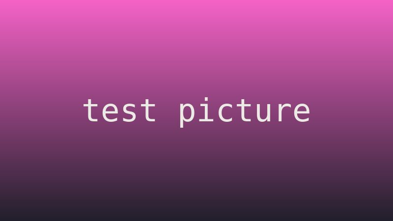
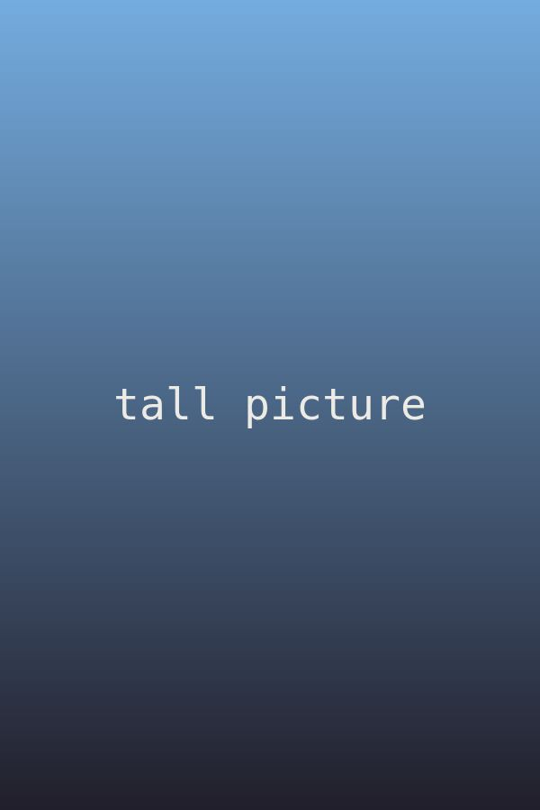

+++
title = "テスト記事"
date = "2020-01-01T12:00:00-03:00"
readingTime = true
noindex = true
hideComments = true
sitemap = { disable = true }
# Hidden: it doesn't show in lists, the home page or RSS. Open it by its URL.
[build]
  list = "never"
+++



これはいろいろ試すための隠し記事です。どの一覧にも出てこないし、検索エンジンにも載らないし、コメントもありません。見出し、長い段落と短い段落、リスト、引用、コード、表、画像など、記事にありそうなものをひととおり入れてあります。何画面かスクロールできる長さがあるので、読書バーも読書ネコも保存した位置も、ちゃんと動くか確かめられます。

何画面か下までスクロールしてから一番上に戻って、少し待ってみてください。読んでいた場所に、バーの上で肉球が出ます。途中でページを再読み込みすると、ネコが保存した場所で待っています。

## 短い見出し

日本語は単語の間にスペースがないので、引用リンクは文字数で切ります。読点、句点、「かぎかっこ」、『二重かぎかっこ』、疑問符？感嘆符！それに3.14や42や1,000,000のような数字もあります。Half-Lifeのような英語とハイフンもまざっています。

この段落はふつうで、特別なものは何もありません。見出しと見出しの間に十分な文があるように置いてあるので、ネコは新しいセクションに着くたびに名前を言えるし、バーの目盛りもくっつかずに並びます。

## ネコが短く切らないといけないとても長いセクションの見出し

ネコはセクションの名前を吹き出しで言いますが、長い名前は入るように切られます。この見出しはわざと長くしてあります。

- [プロジェクトのページへのリンク](/ja/projects/)がある項目。
- [外部リンク](https://example.com/)がある項目。
- **太字**、*斜体*、`インラインコード`がある項目。
  - 入れ子の項目。
  - もうひとつの入れ子の項目。
- 最後の項目。

### 小さい見出し

小さい見出しにもバーの目盛りがつきます。引用はこちら：

> 走れ、考えろ、撃て、生きろ。これはたいていの画面で二行になるくらい長い引用なので、本物っぽく見えます。

コードも少し：

```js
// コードブロック。ページが横に広がらずに、横スクロールするか確かめるためのもの。
const cat = { name: "neko", lives: 9, favorite: "yarn", says: () => "nya~ mrrp? meow =^.^= this line is long on purpose" };
console.log(cat.says());
```

## 表とほかのブロック

| なに | どこ | なぜ |
| --- | --- | --- |
| 読書バー | ページの上 | どこまで読んだか見せる |
| 肉球 | バーの上 | いた場所の印 |
| 目盛り | バーの上 | セクションごとにひとつ |
| 引用リンク | 選んだ言葉の横 | 記事をその場所で開く |

1. 番号つきリスト。
2. 二つめの項目。
3. 三つめの項目。

---

上の線は水平線です。

## あとから読みこまれる画像

下の画像は近づいたときに読みこまれます。サイズはもう決まっているので、出てきてもページはずれません。



## 引用用の長い段落

どの段落でも言葉をいくつか選ぶと、リンクをコピーするボタンが出ます。二つの段落にまたがって選んだり、長い文の途中から選んだりして、難しい場合も試してみてください。

これは言葉を選ぶための長い段落です。最初にも真ん中にも最後にも選べる言葉がたくさんあるように、しばらく続きます。すばやい茶色のキツネがなまけものの犬を飛びこえると、犬は起きて、のびをして、また日なたで寝てしまいました。どこかでネコがそれを全部見ていて、何もしません。それがいちばんネコらしいことです。

最初の段落のすぐあとにある、もうひとつの長い段落です。二つにまたがって選ぶためにあります。とくに何の話でもありません。雨の午後は読書に、晴れた朝は散歩に、夜ふかしは寝るのにいいけれど、だれもそうしません。明日は明日の風がふきます。

もうひとつ、スペースのない長い文字の並び：ああああああああああああああああああああああああああああああああああああああああああああああああああ。

## スクロールするためのもっと長い文

このセクションは記事を長くするためにあります。読む時間が数分になって、バーがゆっくり動くのが見えるように。読むのにも試すのにも時間がかかります。ひと息ついて、少しスクロールして、ネコが何をするか見てください。

スクロールすると、ネコはバーの上を歩きます。止まると座ります。最後まで行くと、次の記事まで歩いて、読むか聞いてきます。いつでもタップすると、あとどれくらいか教えてくれます。

ネコをバーにそってドラッグすると、記事の中を移動できます。バーから引きはなすと持ちあげることになって、次のページまで放した場所にいます。

このページにいるほかの人のゴーストネコも、記事のそれぞれの場所でバーに座ります。二つのウィンドウでこのページを開くと見られます。

## おわり

これでおしまい。一番下までスクロールすると、ネコが別の記事を指さします。
